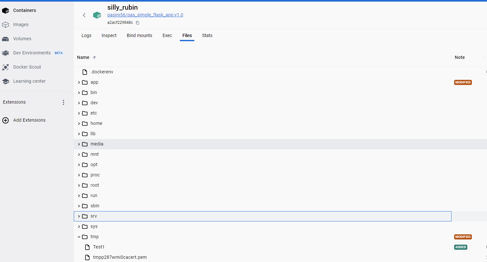

# Part 2: Docker Containers with Commands

## docker run

(The command will create and start the container. It is different from start command which only starts the container)

```
docker run qasim56/qas_simple_flask_app:v1.0  
```

**Output**

```
* Serving Flask app 'app.py'                                                                                                                                                                                          
 * Debug mode: off                                                                                                                                                                                                     
WARNING: This is a development server. Do not use it in a production deployment. Use a production WSGI server instead.                                                                                                 
 * Running on all addresses (0.0.0.0)                                                                                                                                                                                  
 * Running on http://127.0.0.1:5000                                                                                                                                                                                    
 * Running on http://172.17.0.2:5000                                                                                                                                                                                   
 Press CTRL+C to quit                   
```

## 'docker ps' command to list all running containers

(Show all containers. To see only active containers use switch -a)

```
docker ps -a
```

**Output**

```
CONTAINER ID   IMAGE                           COMMAND     CREATED      STATUS      PORTS      NAMES
a2acf229848c qasim56/qas_simple_flask_app:v1.0 "flask run" 5 minutes ago Up 9 seconds 5000/tcp silly_rubin
```

## 'docker stop' command

(Stops a container)

```
docker stop silly_rubin
```

## 

## 'docker rm' command to remove a stopped container

(Undermentioned command will remove stopped container rm xenodochial_benz

```
docker rm xenodochial_benz
```

Output

```
xenodochial_benz
```

## 'docker logs' command to view the logs of a container

```
Docker logs silly_rubin
```

Output

```
* Serving Flask app 'app.py'
 * Debug mode: off
WARNING: This is a development server. Do not use it in a production deployment. Use a production WSGI server instead.
 * Running on all addresses (0.0.0.0)
 * Running on http://127.0.0.1:5000
 * Running on http://172.17.0.2:5000
Press CTRL+C to quit
```

## 'docker inspect' command to view the details of a container

```
Docker inspect silly_rubin
```

Output

```
[
    {
        "Id": "a2acf229848cfa0ba4f7712fcf8086cc57fbe3d3efc439997cfd746cc998f1c6",
        "Created": "2023-11-01T19:10:37.649784034Z",
        "Path": "flask",
        "Args": [
            "run"
        ],
        "State": {
            "Status": "running",
            "Running": true,
            "Paused": false,
            "Restarting": false,
            "OOMKilled": false,
            "Dead": false,
            "Pid": 3449,
            "ExitCode": 0,
            "Error": "",
            "StartedAt": "2023-11-01T19:22:04.475053594Z",
            "FinishedAt": "2023-11-01T19:21:03.976201809Z"
        },
        "Image": "sha256:9022e851c9cbfb96b96174e77da9fc8f87c645fc145e080085b92167244ece38",
        "ResolvConfPath": "/var/lib/docker/containers/a2acf229848cfa0ba4f7712fcf8086cc57fbe3d3efc439997cfd746cc998f1c6/resolv.conf",
        "HostnamePath": "/var/lib/docker/containers/a2acf229848cfa0ba4f7712fcf8086cc57fbe3d3efc439997cfd746cc998f1c6/hostname",
        "HostsPath": "/var/lib/docker/containers/a2acf229848cfa0ba4f7712fcf8086cc57fbe3d3efc439997cfd746cc998f1c6/hosts",
        "LogPath": "/var/lib/docker/containers/a2acf229848cfa0ba4f7712fcf8086cc57fbe3d3efc439997cfd746cc998f1c6/a2acf229848cfa0ba4f7712fcf8086cc57fbe3d3efc439997cfd746cc998f1c6-json.log",
        "Name": "/silly_rubin",
        "RestartCount": 0,
        "Driver": "overlay2",
        "Platform": "linux",
        "MountLabel": "",
        "ProcessLabel": "",
        "AppArmorProfile": "",
        "ExecIDs": null,
        "HostConfig": {
            "Binds": null,
            "ContainerIDFile": "",
            "LogConfig": {
                "Type": "json-file",
                "Config": {}
            },
            "NetworkMode": "default",
            "PortBindings": {},
            "RestartPolicy": {
                "Name": "no",
                "MaximumRetryCount": 0
            },
            "AutoRemove": false,
            "VolumeDriver": "",
            "VolumesFrom": null,
            "ConsoleSize": [
                24,
                200
            ],
            "CapAdd": null,
            "CapDrop": null,
            "CgroupnsMode": "host",
            "Dns": [],
            "DnsOptions": [],
            "DnsSearch": [],
            "ExtraHosts": null,
            "GroupAdd": null,
            "IpcMode": "private",
            "Cgroup": "",
            "Links": null,
            "OomScoreAdj": 0,
            "PidMode": "",
            "Privileged": false,
            "PublishAllPorts": false,
            "ReadonlyRootfs": false,
            "SecurityOpt": null,
            "UTSMode": "",
            "UsernsMode": "",
            "ShmSize": 67108864,
            "Runtime": "runc",
            "Isolation": "",
            "CpuShares": 0,
            "Memory": 0,
            "NanoCpus": 0,
            "CgroupParent": "",
            "BlkioWeight": 0,
            "BlkioWeightDevice": [],
            "BlkioDeviceReadBps": [],
            "BlkioDeviceWriteBps": [],
            "BlkioDeviceReadIOps": [],
            "BlkioDeviceWriteIOps": [],
            "CpuPeriod": 0,
            "CpuQuota": 0,
            "CpuRealtimePeriod": 0,
            "CpuRealtimeRuntime": 0,
            "CpusetCpus": "",
            "CpusetMems": "",
            "Devices": [],
            "DeviceCgroupRules": null,
            "DeviceRequests": null,
            "MemoryReservation": 0,
            "MemorySwap": 0,
            "MemorySwappiness": null,
            "OomKillDisable": false,
            "PidsLimit": null,
            "Ulimits": null,
            "CpuCount": 0,
            "CpuPercent": 0,
            "IOMaximumIOps": 0,
            "IOMaximumBandwidth": 0,
            "MaskedPaths": [
                "/proc/asound",
                "/proc/acpi",
                "/proc/kcore",
                "/proc/keys",
                "/proc/latency_stats",
                "/proc/timer_list",
                "/proc/timer_stats",
                "/proc/sched_debug",
                "/proc/scsi",
                "/sys/firmware"
            ],
            "ReadonlyPaths": [
                "/proc/bus",
                "/proc/fs",
                "/proc/irq",
                "/proc/sys",
                "/proc/sysrq-trigger"
            ]
        },
        "GraphDriver": {
            "Data": {
                "LowerDir": "/var/lib/docker/overlay2/7899e2eae130f69ec3946a7d66652dab99526bdceff350041dd3c5b28579f4aa-init/diff:/var/lib/docker/overlay2/lugm5jwg4qzzhua302a1ylfmh/diff:/var/lib/docker/overlay2/gjgm819i5ghods2te7g4gbgff/diff:/var/lib/docker/overlay2/ua9a1p2by4qul0f6pd7iext27/diff:/var/lib/docker/overlay2/eveoto0qxy029w3slxpla0gpg/diff:/var/lib/docker/overlay2/e91afc33b2a42d622b2585e078ae6bd2ab3993225787e0ccb48a4dbf81c1fb68/diff:/var/lib/docker/overlay2/8fc09e2a02b51760f311cd26ec01c07073922f5a177843b516dc850bd7c6873f/diff:/var/lib/docker/overlay2/b1c7d1bf8e6993aeff01a5cc924247037764d3d41ec1d7d3e46d765778482658/diff:/var/lib/docker/overlay2/4603602c15398be7a11ba6357d06b05ed12ce8f25c6b6095529cc62f25bcab39/diff:/var/lib/docker/overlay2/2fe03668bf2dac4a8ad880ee3fa3a52d4784abbbc9f9f912275a847fb973c76d/diff",
                "MergedDir": "/var/lib/docker/overlay2/7899e2eae130f69ec3946a7d66652dab99526bdceff350041dd3c5b28579f4aa/merged",
                "UpperDir": "/var/lib/docker/overlay2/7899e2eae130f69ec3946a7d66652dab99526bdceff350041dd3c5b28579f4aa/diff",
                "WorkDir": "/var/lib/docker/overlay2/7899e2eae130f69ec3946a7d66652dab99526bdceff350041dd3c5b28579f4aa/work"
            },
            "Name": "overlay2"
        },
        "Mounts": [],
        "Config": {
            "Hostname": "a2acf229848c",
            "Domainname": "",
            "User": "",
            "AttachStdin": false,
            "AttachStdout": true,
            "AttachStderr": true,
            "ExposedPorts": {
                "5000/tcp": {}
            },
            "Tty": false,
            "OpenStdin": false,
            "StdinOnce": false,
            "Env": [
                "PATH=/usr/local/bin:/usr/local/sbin:/usr/local/bin:/usr/sbin:/usr/bin:/sbin:/bin",
                "LANG=C.UTF-8",
                "GPG_KEY=E3FF2839C048B25C084DEBE9B26995E310250568",
                "PYTHON_VERSION=3.9.18",
                "PYTHON_PIP_VERSION=23.0.1",
                "PYTHON_SETUPTOOLS_VERSION=58.1.0",
                "PYTHON_GET_PIP_URL=https://github.com/pypa/get-pip/raw/c6add47b0abf67511cdfb4734771cbab403af062/public/get-pip.py",
                "PYTHON_GET_PIP_SHA256=22b849a10f86f5ddf7ce148ca2a31214504ee6c83ef626840fde6e5dcd809d11",
                "FLASK_APP=app.py",
                "FLASK_RUN_HOST=0.0.0.0",
                "FLASK_RUN_PORT=5000"
            ],
            "Cmd": [
                "flask",
                "run"
            ],
            "Image": "qasim56/qas_simple_flask_app:v1.0",
            "Volumes": null,
            "WorkingDir": "/app",
            "Entrypoint": null,
            "OnBuild": null,
            "Labels": {}
        },
        "NetworkSettings": {
            "Bridge": "",
            "SandboxID": "3f8ccc2b5d5be0c3c6c03bfd56ce8653c987f37fca3175c18ccfdc538672aaee",
            "HairpinMode": false,
            "LinkLocalIPv6Address": "",
            "LinkLocalIPv6PrefixLen": 0,
            "Ports": {
                "5000/tcp": null
            },
            "SandboxKey": "/var/run/docker/netns/3f8ccc2b5d5b",
            "SecondaryIPAddresses": null,
            "SecondaryIPv6Addresses": null,
            "EndpointID": "210d8968482c242d5396d38a1666f440d3148a0d3691ece943b3083e0b47eee8",
            "Gateway": "172.17.0.1",
            "GlobalIPv6Address": "",
            "GlobalIPv6PrefixLen": 0,
            "IPAddress": "172.17.0.2",
            "IPPrefixLen": 16,
            "IPv6Gateway": "",
            "MacAddress": "02:42:ac:11:00:02",
            "Networks": {
                "bridge": {
                    "IPAMConfig": null,
                    "Links": null,
                    "Aliases": null,
                    "NetworkID": "14398b13c74023de732c0db02d2cb8a556b1e26dac8b258fb4a4c99e773171ea",
                    "EndpointID": "210d8968482c242d5396d38a1666f440d3148a0d3691ece943b3083e0b47eee8",
                    "Gateway": "172.17.0.1",
                    "IPAddress": "172.17.0.2",
                    "IPPrefixLen": 16,
                    "IPv6Gateway": "",
                    "GlobalIPv6Address": "",
                    "GlobalIPv6PrefixLen": 0,
                    "MacAddress": "02:42:ac:11:00:02",
                    "DriverOpts": null
                }
            }
        }
    }
]
```

## 

## 'docker exec' command to execute a command inside a running container

(Undermentioned command will create a Test folder inside running container silly_rubin

```
docker exec -d silly_rubin touch /tmp/Test1
```



## 'docker commit' command to create a new image from a container

(Undermentioned command created a new image named ‘none’ from a container ‘hopeful_lamport’)

```
docker commit hopeful_lamport
```

Output

```
sha256:84609c580e8e149792f813c7dfdf9f558318cc64acac4e0dd454ceddcb1c5b38
```

## 'docker cp' command to copy files/folders between the container and the

## Host

(The command can be used for copying file e.g from local machine to container or vice versa.Undermentioned command copy a file named ‘test’ from container tmp directory to D drive opt directory

```
docker cp silly_rubin:/tmp/Test1 /opt/Test1
```

Output

```
Successfully copied 1.54kB to D:\opt\Test1
```

## 'docker stats' command to view the resource usage of containers

```
Docker stats
```

**Output**

```
CONTAINER ID   NAME     CPU %   MEM USAGE/LIMIT  MEM %  NET I/O  BLOCK I/O PIDS
a2acf229848c silly_rubin 0.01% 27.18MiB/3.777GiB 0.70% 1.46kB/0B  0B/0B    1   
```

## 'docker top' command to view the running processes inside a container

```
docker top silly_rubin
```

**Output**

```
UID     PID    PPID  C     STIME   TTY  TIME      CMD
root    862    840   0     09:40    ?  00:00:00  /usr/local/bin/python /usr/local/bin/flask run
```

## 'docker start' command to start a stopped container

```
docker start silly_rubin
```

**Output**

```
silly_rubin
```

## 'docker pause' command to pause a running container

```
Docker pause silly_rubin
```

**Output**

```
silly_rubin
```

## 'docker unpause' command to unpause a paused container

```
Docker unpause silly_rubin
```

**Output**

```
silly_rubin
```

## 'docker rename' command to rename a container (U/M command renames container to candy)

```
docker rename hopeful_lamport candy
```

## 

## 'docker wait' command to wait for a container to exit and then display its exit code

wait and stop the container ‘candy’

```
docker wait candy
```

in another terminal

```
docker stop candy
```

The first terminal Output

```
137
```

## 'docker attach' command to attach local standard input, output, and error

## streams to a running container

```
docker container attach candy   
```

**Output**

The command displays ‘Hello World” on web browser **http://127.0.0.1:5000/**

```
172.17.0.1 - - [02/Nov/2023 10:15:56] "GET / HTTP/1.1" 200 -
172.17.0.1 - - [02/Nov/2023 10:15:56] "GET /favicon.ico HTTP/1.1" 404 -
```

## 'docker port' command to display the public-facing port that a container is

## listening on

```
docker port candy
```

**Output**

```
5000/tcp -> 0.0.0.0:5000
```

## \*\*'docker update' to update a container's resource limits (\*\*limit a container's cpu-shares to 512)

```
docker update --cpu-shares 512 candy
```

**Output**

```
candy
```

## 'docker restart' command to restart a running container

```
Docker restart candy
```
